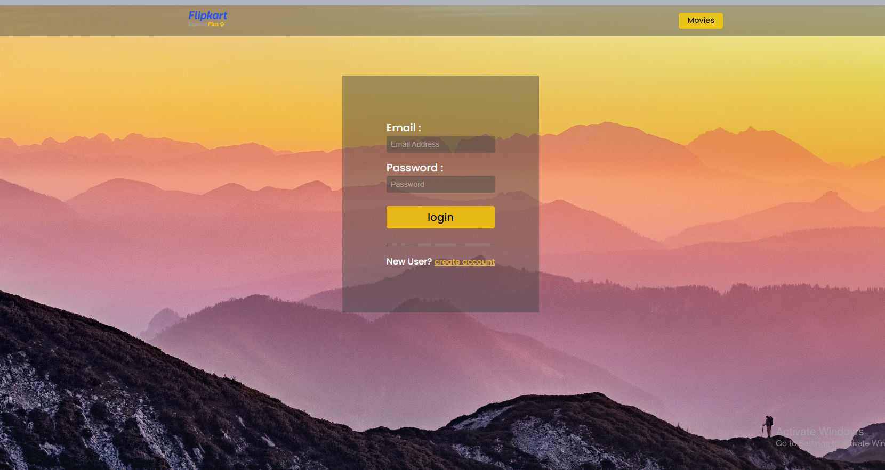
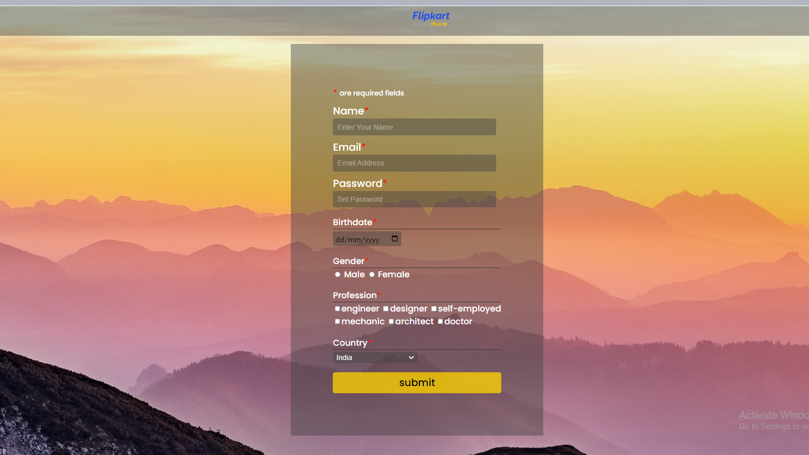

## Authentication in SailsJs

### Features:
- verification mail
- allow only verified user to login
- prevent access to movie list in case if user is not logged in (using policy)

## Login page :

## Register page :

# actions

a [Sails v1](https://sailsjs.com) application

### Links

+ [Sails framework documentation](https://sailsjs.com/get-started)
+ [Version notes / upgrading](https://sailsjs.com/documentation/upgrading)
+ [Deployment tips](https://sailsjs.com/documentation/concepts/deployment)
+ [Community support options](https://sailsjs.com/support)
+ [Professional / enterprise options](https://sailsjs.com/enterprise)
